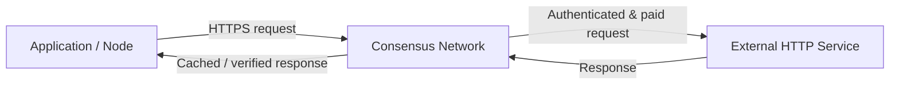

Consensus is a decentralized **HTTPS protocol** that operates as a proxy on behalf of applications.

It provides a secure, authenticated, and payment-enforced layer for HTTP requests, ensuring that requests are executed **once**, responses are **verifiable**, and access to network resources is **fairly priced**.

---

## Core properties

:::note[HTTPS by default]
Consensus operates entirely over **HTTPS**, ensuring encrypted transport for all requests and responses.
:::

:::note[Mutual authentication (mTLS)]
All participants interacting with the network authenticate using **mutual Transport Layer Security (mTLS)**.  
This guarantees the **integrity** and **authenticity** of data exchanged within the network.
:::

:::note[Payment-enforced routes]
All Consensus routes are protected by **[x402](https://www.x402.org)** — an HTTP payment protocol that requires users to pay before requests are processed.
:::

---

## What Consensus does

Consensus acts as a **deduplicating proxy**.

Incoming requests are **canonicalized** to produce a unique fingerprint. If an identical request has already been processed, Consensus returns the cached response instead of executing the request again.

:::tip[Why this matters]
In replicated systems, the same HTTP request may be issued many times by different nodes.  
Consensus ensures **one execution, one payment, one result** — regardless of how many replicas are involved.
:::

This makes Consensus especially useful for **replicated systems**, such as blockchains, where deterministic behavior and cost control are critical.

---

## High-level architecture

